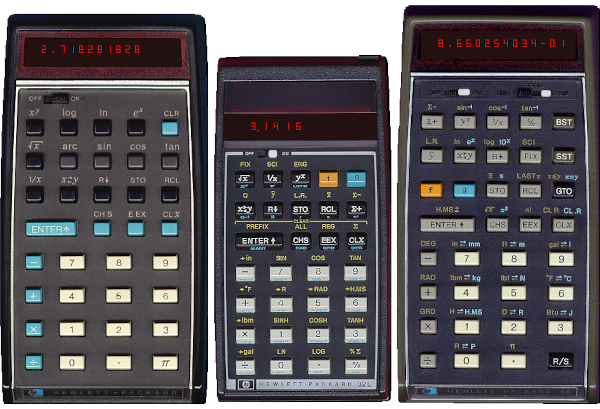

.. image:: https://github.com/ra1fh/nonpareil/actions/workflows/build.yml/badge.svg
    :target: https://github.com/ra1fh/nonpareil/actions/workflows/build.yml

Nonpareil Simulator for Electronic Calculators
==============================================

Nonpareil is a microcode-level simulator for electronic calculators
written by Eric Smith and published at
`https://nonpareil.brouhaha.com/ <https://nonpareil.brouhaha.com/>`_

This repository contains some modifications compared to nonpareil-0.79:

* The build system has been replaced with CMake3
* The ROMs are not included and will instead be downloaded during the build
* Some compilation fixes to compile with with modern compilers

Currently it is able to simulate some of the HP calculators introduced
between 1972 and 1982:

* HP-35, HP-45, HP-55, HP-80
* HP-21, HP-25,
* HP-31E, HP-33C, HP-34C, HP-37E, HP-38E, HP-38C
* HP-41CV, HP-41CX

Building and Installing
-----------------------

Build Requirements:

* CMake >= 3.11
* bison >= 3.0
* flex
* libxml2
* libpng
* SDL 1.2
* GTK+-2

Debian/Ubuntu:

::

   apt install cmake flex libfl-dev bison libxml2-dev \
        libpng-dev libsdl1.2-dev libgtk2.0-dev

Fedora

::

   dnf install cmake flex libfl-devel bison libxml2-devel \
        libpng-devel sdl12-compat-devel gtk2-devel

OpenBSD

::

   pkg_add cmake bison libxml png sdl gtk+2

Compilation:

::

   mkdir -p build
   cd build
   cmake ..
   make

Installation:

::

   make install

Usage
-----

* Start nonpareil and select a calculator model by loading a KML file
* Use one of the alias commands that preselect a KML file: 21,
  25, 32e, 33c, 34c, 35, 37e, 38c, 38e, 41cv, 41cx, 45, 55

::

   usage: nonpareil [options...] kmlfile
   options:
      --shape (default)
      --noshape
      --kmldebug
      --kmldump
      --scancodedebug
      --stop
